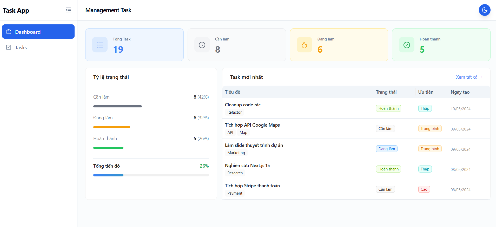
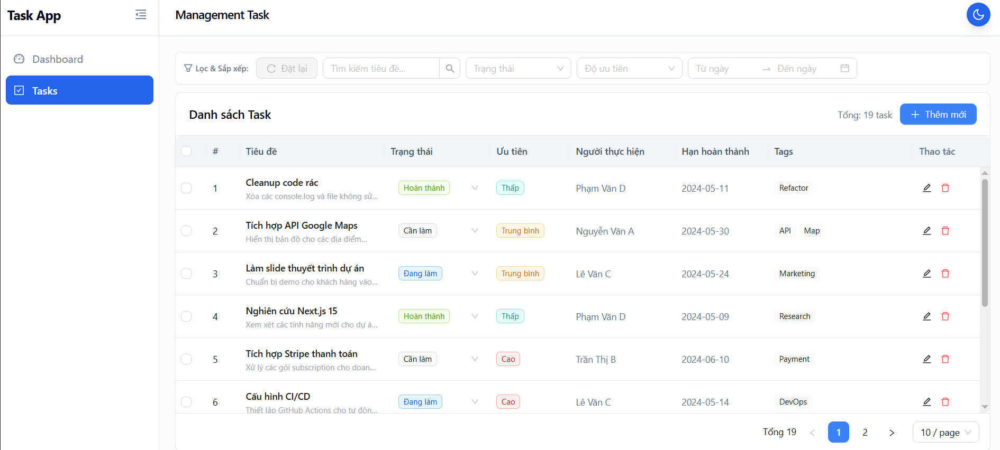
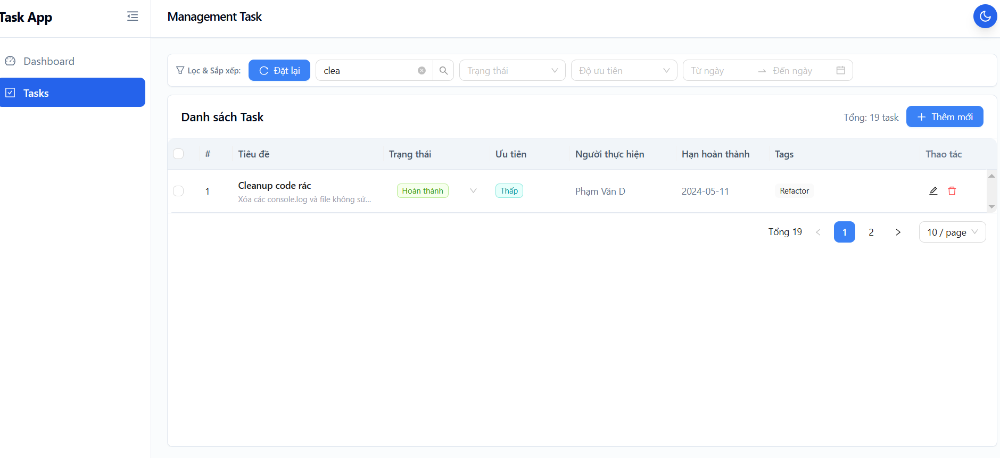
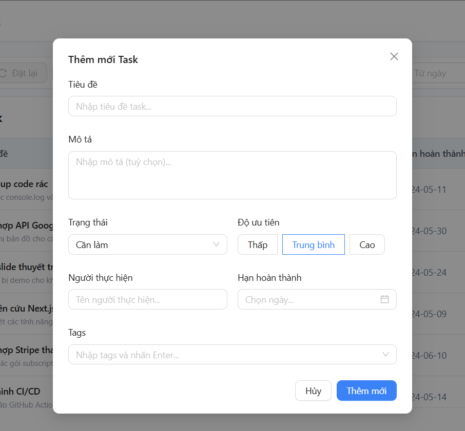
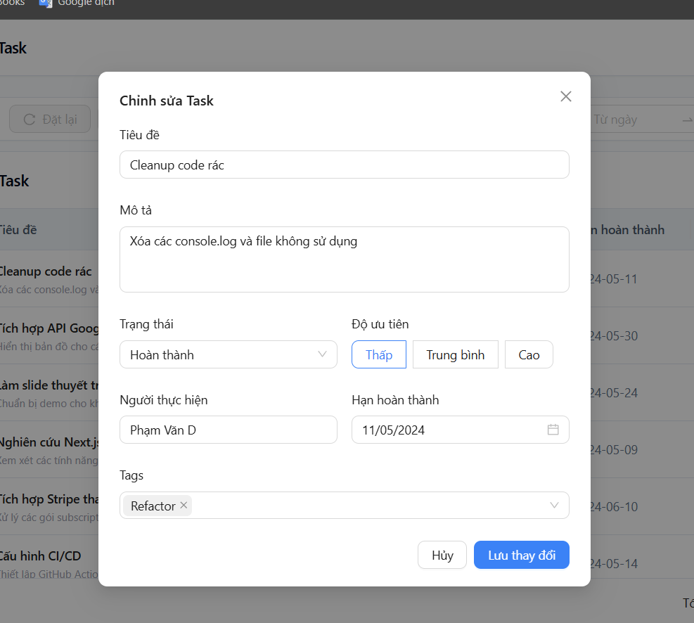
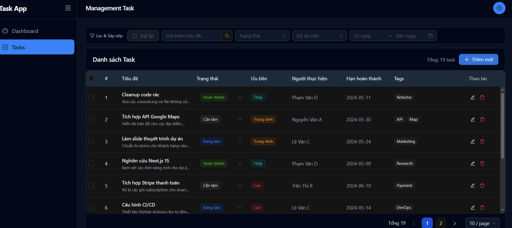
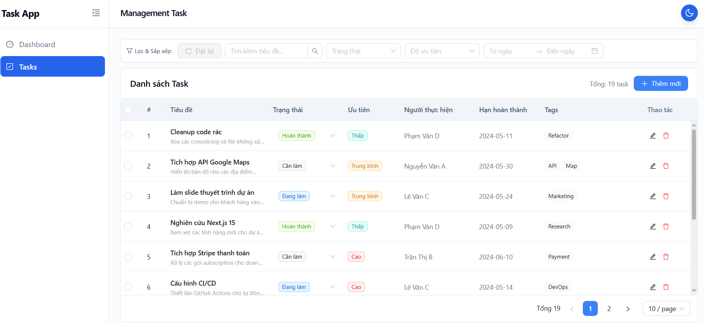

# Task Management Dashboard

Một ứng dụng quản lý công việc toàn diện, được thiết kế với giao diện hiện đại, tối ưu trải nghiệm người dùng (UX) và hỗ trợ đầy đủ các tính năng cần thiết cho việc theo dõi tiến độ công việc.

## 🚀 Tính Năng Nổi Bật

### 1. Dashboard Thống Kê
- **Tổng quan nhanh**: Hiển thị tổng số lượng task và phân loại theo trạng thái (Cần làm, Đang làm, Hoàn thành).
- **Trực quan hóa**: Biểu đồ/Thanh tiến độ (Progress bar) thể hiện tỷ lệ hoàn thành công việc.
- **Truy cập nhanh**: Hiển thị danh sách 5 công việc được tạo gần đây nhất.

### 2. Quản Lý Task Toàn Diện (CRUD)
- **Thêm/Sửa Task**: Modal form thân thiện, tự động điền dữ liệu khi chỉnh sửa, validate dữ liệu chặt chẽ.
- **Xóa Task**: Hỗ trợ xóa đơn lẻ và xóa hàng loạt (Bulk delete) với hộp thoại xác nhận an toàn.
- **Cập nhật nhanh**: Thay đổi trạng thái task trực tiếp ngay trên bảng (Inline edit) mà không cần mở form.

### 3. Tìm Kiếm & Lọc Nâng Cao
- Tìm kiếm theo tiêu đề công việc.
- Lọc theo nhiều tiêu chí: Trạng thái, Độ ưu tiên, Khoảng thời gian (Hạn chót).
- Trạng thái bộ lọc và phân trang được đồng bộ hóa với URL, cho phép chia sẻ link hoặc tải lại trang mà không mất kết quả đang xem.
- Dữ liệu luôn được sắp xếp thông minh (Task mới nhất ưu tiên hiển thị trước).

### 4. Giao Diện Hiện Đại & Tối Ưu UX
- **Chế độ Sáng/Tối (Dark/Light Mode)**: Chuyển đổi mượt mà, đồng bộ hoàn hảo giữa Tailwind CSS và các component của Ant Design.
- **Responsive**: Giao diện được tối ưu hiển thị tốt trên cả màn hình Desktop và Tablet.
- **Fake Loading**: Hiệu ứng chuyển cảnh mượt mà khi chuyển trang hoặc thay đổi bộ lọc, mang lại cảm giác ứng dụng chuyên nghiệp.

### 5. Lưu Trữ Dữ Liệu (Caching)
- Sử dụng `redux-persist` để lưu trữ dữ liệu cục bộ. Các task, bộ lọc, và vị trí trang của bạn sẽ được giữ nguyên ngay cả khi bạn tải lại ứng dụng.

---

## 📸 Demo & Screenshots

> Hình ảnh và GIF demo sẽ được cập nhật tại đây.

### Link deploy fe
[Xem bản Live Demo tại đây](https://fe-test-nguyen-tien-dat.vercel.app/dashboard)
### Dashboard


### Task List & Filter



### Thêm Mới / Chỉnh Sửa Task



### Dark Mode



---

## 🛠 Công Nghệ Sử Dụng

- **Core**: React 18, TypeScript, Vite
- **UI Framework/Styling**: Tailwind CSS, Ant Design (AntD)
- **State Management**: Redux Toolkit, Redux Persist
- **Routing**: React Router DOM (xử lý routing trong react)
- **Khác**: Day.js (xử lý thời gian)

---

## 📦 Cài Đặt & Chạy Ứng Dụng

Ứng dụng sử dụng **Yarn** (PnP) làm trình quản lý gói. Đảm bảo bạn đã cài đặt Node.js và Yarn trên máy.

### 1. Clone repository
```bash
git clone <repository-url>
cd app
```

### 2. Cài đặt dependencies
```bash
yarn install
```

### 3. Chạy môi trường phát triển (Development)
```bash
yarn dev
```
Ứng dụng sẽ chạy tại địa chỉ: `http://localhost:5173` (hoặc port khác tùy Vite hiển thị).

### 4. Build cho Production (Tùy chọn)
```bash
yarn build
yarn preview
```
